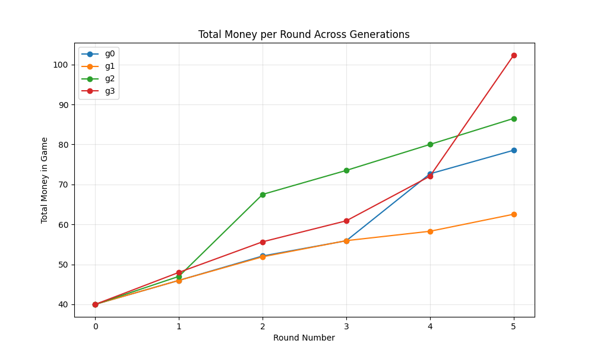
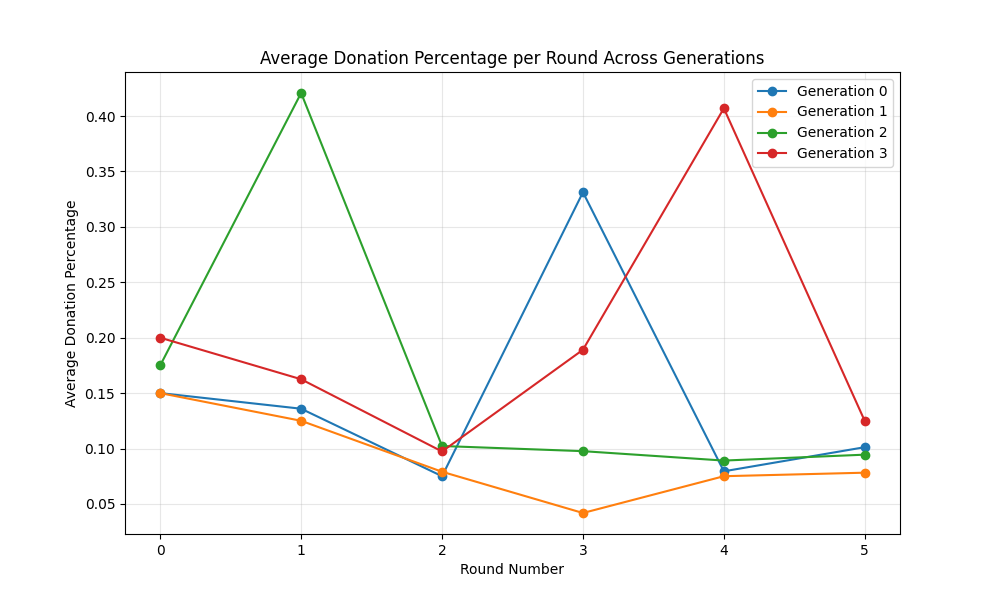

# Implementation of the Paper: "Cultural Evolution of Cooperation among LLM Agents"

## Objective
This project implements the methodology outlined in the paper *Cultural Evolution of Cooperation among LLM Agents* by Vallinder and Hughes (2024). The paper explores whether a society of large language model (LLM) agents can develop cooperative norms through cultural evolution, using the classic *Donor Game*. The goal is to evaluate multi-agent interaction dynamics and the emergence of cooperation under iterative deployment.

Read the paper here: [*Cultural Evolution of Cooperation among LLM Agents*](https://arxiv.org/pdf/2412.10270)


_Toy run illustrating the flow of the simulation._

## NOTE
Currently in development but the foundations are set.

This implementation consists of:
1. **A Numeric Simulation**: A simplified representation of the Donor Game.
2. **An Agentic Simulation**: A sophisticated model leveraging OpenAI's client SDK with structured outputs.

## Purpose
The numeric simulation validates the stability and cooperative potential of simplified Donor Game setups. The agentic simulation extends this by exploring emergent behaviors in LLM-based agents under culturally evolutionary conditions. The agentic approach also includes mechanisms for strategy generation, decision-making, and multi-generational evolution.

## Quickstart

### Prerequisites
- Python 3.10+
- Required Python libraries (install via `requirements.txt`):
  ```bash
  pip install -r requirements.txt
  ```
- OpenAI API credentials (add `.env` file with your API key, based on `.env.example`).

### Run the Numeric Simulation
1. Open the [**`donors_game-numeric.ipynb`**](./donors_game-numeric.ipynb) notebook.
2. Execute the cells to simulate the numeric Donor Game and visualize total reputation and wallet outcomes over iterations.

### Run the Agentic Simulation
1. Open the [**`donors_game-agentic.ipynb`**](./donors_game-agentic.ipynb) notebook.
2. Execute the cells to simulate multi-generation cooperative evolution among LLM agents using OpenAI's SDK.
3. Modify hyperparameters (e.g., number of players, trace depth, donation multiplier) as needed to explore various scenarios.

### File Legend
- **[`.env`](./.env)**: Contains API credentials for OpenAI.
- **[`.env.example`](./.env.example)**: Example file to set up your environment variables.
- **[`donors_game-numeric.ipynb`](./donors_game-numeric.ipynb)**: Simulates the Donor Game using a numeric approach.
- **[`donors_game-agentic.ipynb`](./donors_game-agentic.ipynb)**: Implements the Donor Game for LLM agents with strategy evolution using OpenAI's SDK.
- **[`README.md`](./README.md)**: This readme document.
- **[`requirements.txt`](./requirements.txt)**: Lists required dependencies for the project.
- **[`Vallinder and Hughes - 2024 - Cultural Evolution of Cooperation among LLM Agents.pdf`](./NOTES-Vallinder%20and%20Hughes%20-%202024%20-%20Cultural%20Evolution%20of%20Cooperation%20among%20LLM%20Agents.pdf)**: Notes on the original paper (download to see notes).

## Analysis
Data is saved in the `data` folder by default. The data is saved according to the pattern described by this python code:
```Python
  def save_state(self):
    self.history[f"g{self.game_state.generation}"] = [player.model_dump() for player in self.players]
    os.makedirs(os.path.dirname(self.save_path), exist_ok=True)
    data = self.game_state.model_dump()
    data["history"] = self.history
    with open(self.save_path, "w") as f:
      json.dump(data, f)
```
Where `self.game_state.generation` is a string indicating the generation number, and `self.save_path` is a string indicating the path to the file where the data is saved.
Also `self.game_state` is the following class:
```Python
class DynamicGameState(BaseModel):
  generation: int
  round: int

class GameConfig(BaseModel):
  donation_multiplier: float = 2
  trace_depth: int = 3
  base_wallet: int = 10
  generations: int = 10
  rounds: int = 12
  players: int = 12
  cutoff_threshold: float = 0.5

class GameState(GameConfig, DynamicGameState):
  pass
```
Finally `player.model_dump()` is a function that serializes the player class in as follows:
```Python
  def model_dump(self):
    return {
      "name": self.name,
      "parents": [parent.name for parent in self.parents],
      "history": [decision.model_dump() for decision in self.history],
      "wallet": self.wallet,
      "strategy": self.strategy
    }
```
Where `self.name` is the player's name, `self.parents` is a list of the player's parents (who are also players), `self.history` is a list of the player's decisions, `self.wallet` is the player's wallet, and `self.strategy` is the player's strategy.
This is what a `Decision` class looks like:
```Python
class DynamicGameState(BaseModel):
  generation: int
  round: int
class Decision(BaseModel):
  # agents data
  recipient_name: str
  donor_name: str
  # game state data
  dynamic_game_state: DynamicGameState
  # donation data
  donation_percent: float
  donation_amount: float
  # donor wallet data
  donor_wallet_before: float
  donor_wallet_after: float
  
  class Config:
    arbitrary_types_allowed = True
```

### Results

Here are the key visualizations from our simulation runs:

#### Total Money in Game

*Figure 1: Total money in the game system across rounds for each generation*

#### Average Donation Percentage

*Figure 2: Average donation percentage per round across generations*

#### Maximum Donation Percentage

*Figure 3: Highest donation percentage made in each round across generations*

#### Maximum Wallet Amount

*Figure 4: Highest wallet amount held by any player in each round across generations*

## Development Status
The project is in active development. The next steps include:
0. [x] Round donations parallelization.
1. [x] Implementing telemetry for the agentic script to improve analysis of results and facilitate troubleshooting.
2. [ ] Use both manual tracing and OpenAI instrumentation.
3. [ ] Results analysis

## Further Research
- Explore hereditary single-parent taxonomies in evolutionary game theory for additional insights into strategy development.

Stay tuned for updates and enhancements!
